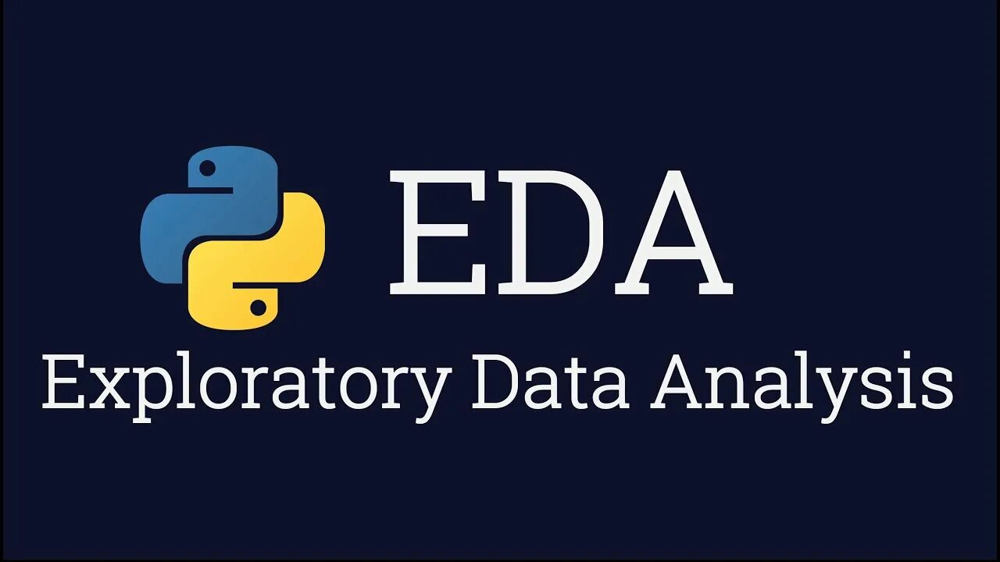

# Исследование данных для HR-агентства (Проект)


## Примечание:
Для данной работы требовалась установка отдельных библиотек для python:

- SciPy — библиотека для научных и инженерных расчётов.
- Statsmodels — библиотека для статистических исследований.

Для установки библиотек:

```python
    ! pip install scipy
    ! pip install statsmodels
```

**Для работы с данным проектом необходима установка библиотек указанных выше:**

## Цель проекта

Закрепить полученные знания в области разведывательного анализа данных (EDA) и проведения ряда статистических тестов.

## Данный проект состоит из четырёх частей:

1. постановки задачи

2. загрузки и обработки данных

3. визуального анализа данных

3. ответы на ключевые вопросы с помощью визуального анализа

3. ответы на ключевые вопросы с помощью статистических тестов

4. заключение

## Проект оформлен согласно требованиям:

- Решение оформлено только в Jupyter Notebook.

- Выявлены факторы влияющие на зарплату специалиста Data Scientist и сделаны выводы по ключевым вопросам.

- При работе с проектом использовалось руководством PEP 8.

- Каждое задание выполнено в отдельной ячейке, сделан промежуточный вывод.

- Код для каждого задания оформлен в одной-двух Jupyter-ячейках.

- В проекте использовались только: переменные, основные структуры данных (списки, словари, множества), циклы, функции, библиотеки numpy, pandas, seaborn, scipy, statsmodels.

Графики содержут: 

1. название, отражающее их суть;

2. подписи осей.

Выводы к графикам оформлены в формате Markdown под самим графиком в отдельной ячейке.

Выводы представлены в виде небольших заключений.

- Сделан заключительный (подробный) вывод по всей работе.
